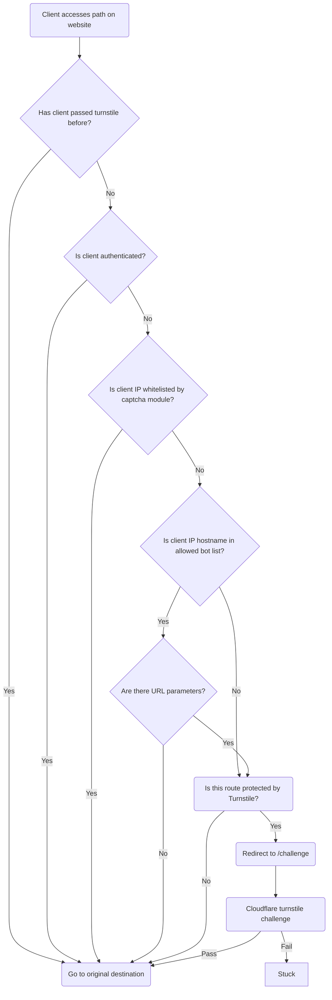

## INTRODUCTION

The Turnstile Protect module is a DESCRIBE_THE_MODULE_HERE.

The primary use case for this module is:

- Use case #1
- Use case #2
- Use case #3

## REQUIREMENTS

- Turnstile
- Captcha

## INSTALLATION

Install as you would normally install a contributed Drupal module.
See: https://www.drupal.org/node/895232 for further information.

## CONFIGURATION
- Configuration step #1
- Configuration step #2
- Configuration step #3

## MAINTAINERS

Current maintainers for Drupal 10:

- Joe Corall (joecorall) - https://www.drupal.org/u/joecorall
