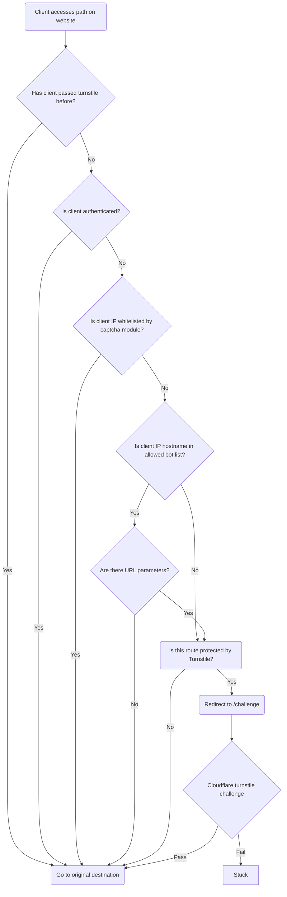

## INTRODUCTION

The Turnstile Protect module is a way to put site routes behind a Cloudflare Turnstile.

The primary use case for this module is:

- You have a route (or routes) on your Drupal site that do not need indexed by search engines you want to protect from excessive crawling

## How it works

## REQUIREMENTS

- [Turnstile](https://www.drupal.org/project/turnstile)
- [Captcha](https://www.drupal.org/project/captcha)

## INSTALLATION

Install as you would normally install a contributed Drupal module.
See: https://www.drupal.org/node/895232 for further information.

## CONFIGURATION

- Follow [the turnstile module install instructions](https://www.drupal.org/project/turnstile)
- Configure which route(s) to protect - (TODO - implement config settings)
- If you want to exclude IPs from being protected, configure them in the captcha IP settings on your site at `/admin/config/people/captcha`

## MAINTAINERS

Current maintainers for Drupal 10:

- Joe Corall (joecorall) - https://www.drupal.org/u/joecorall
